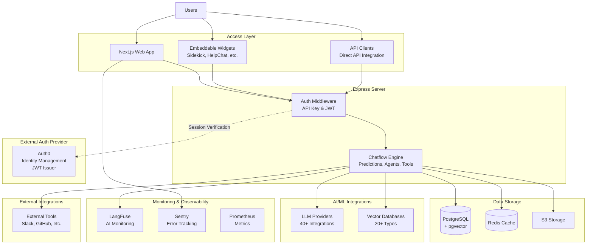
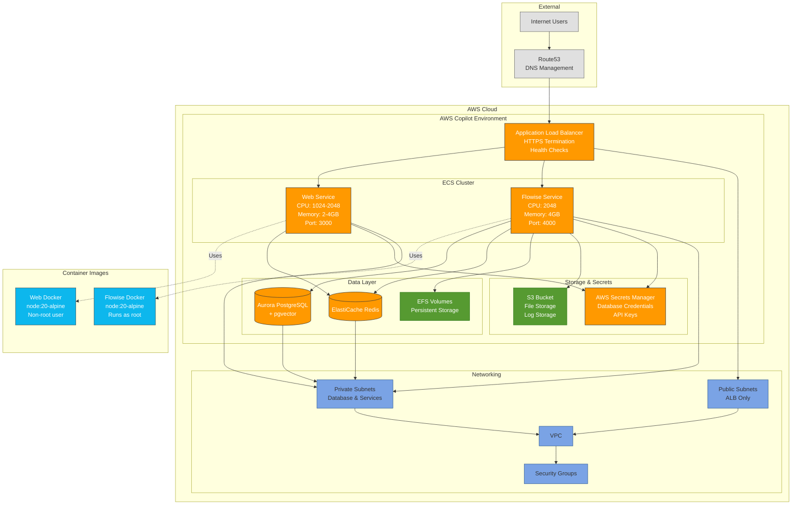

# TheAnswer.AI Security Architecture Documentation

## Executive Summary

TheAnswer.AI is a comprehensive AI agent platform built with a multi-layered security architecture. The system combines a Next.js frontend with a Flowise backend, Auth0 authentication, AWS cloud services, and advanced observability through LangFuse. This document provides a detailed security analysis with accurate implementation references.

> **⚠️ Security Notice**: This document reflects the actual implementation state as of December 2024, including security gaps that need addressing.

## System Overview

### Core Architecture

-   **Frontend**: Next.js web application (Port 3000)
-   **Backend**: Flowise server with Express.js API (Port 4000)
-   **Database**: PostgreSQL with pgvector extension
-   **Cache**: Redis for sessions and rate limiting
-   **File Storage**: Configurable (Local, AWS S3, Google Cloud Storage)
-   **Deployment**: AWS ECS via Copilot / Docker containers
-   **Observability**: LangFuse for AI monitoring, Sentry for error tracking, Prometheus metrics

## High-Level Architecture



## Deployment Architecture (AWS Copilot)



## Architecture Component Reference Table

| Component                            | Description                                   | Implementation Path                                 | Key Files               |
| ------------------------------------ | --------------------------------------------- | --------------------------------------------------- | ----------------------- |
| **External Access Layer**            |
| Web Users                            | Browser-based access                          | N/A                                                 | N/A                     |
| API Clients                          | Apps, extensions, workflows                   | `/api/v1/*` endpoints                               | Multiple                |
| Embed Widget                         | Client-side widget for external sites         | `/packages/embed/`                                  | `index.html`            |
| **AWS Infrastructure (Entry Point)** |
| Application Load Balancer            | HTTPS termination, routing                    | `/copilot/`                                         | `manifest.yml`          |
| Route53                              | DNS management                                | Configuration                                       | N/A                     |
| **Authentication Services**          |
| Auth0                                | JWT authentication (Default: HS256)           | `/packages/server/src/middlewares/authentication/`  | `auth0.ts`              |
| API Key Service                      | Bearer token auth (stores keys as plain text) | `/packages/server/src/middlewares/authentication/`  | `apiKey.ts`             |
| **Application Services**             |
| Next.js Web                          | Frontend application (Port 3000)              | `/apps/web/`                                        | `middleware.ts`         |
| Flowise API                          | Backend Express server (Port 4000)            | `/packages/server/src/`                             | `index.ts`              |
| **Core Business Logic**              |
| Chatflow Engine                      | LLM orchestration (40+ providers)             | `/packages/server/src/services/chatflows/`          | `index.ts`              |
| AI Agents                            | Autonomous workflows                          | `/packages/server/src/services/agents/`             | Multiple                |
| Rate Limiter                         | Redis-backed request throttling               | `/packages/server/src/utils/`                       | `rateLimit.ts`          |
| **Data Storage**                     |
| PostgreSQL                           | Main database + pgvector extension            | `/packages/server/src/database/`                    | `entities/*`            |
| Redis Cache                          | Session storage and rate limiting             | Configuration                                       | ENV vars                |
| S3/GCS Storage                       | File and log storage                          | `/packages/server/node_modules/flowise-components/` | `storageUtils.ts`       |
| **AI/ML Integrations**               |
| LLM Providers                        | 40+ integrations (OpenAI, Anthropic, etc.)    | `/packages/components/nodes/chatmodels/`            | 40+ directories         |
| Vector Databases                     | 20+ types (Pinecone, Qdrant, etc.)            | `/packages/components/nodes/vectorstores/`          | 20+ directories         |
| **Monitoring & Observability**       |
| LangFuse                             | AI monitoring (31 files)                      | `/packages/server/src/routes/langfuse/`             | Multiple                |
| Sentry                               | Error tracking (web only)                     | `/apps/web/`                                        | `sentry.*.config.js`    |
| Prometheus                           | Metrics endpoint                              | `/packages/server/src/metrics/`                     | `Prometheus.ts`         |
| **External Integrations**            |
| External Tools                       | 3rd party services                            | `/packages/components/nodes/tools/`                 | Multiple                |
| **Infrastructure (AWS Copilot)**     |
| Docker                               | Container runtime                             | `/` and `/apps/web/`                                | `Dockerfile`            |
| AWS ECS                              | Container orchestration                       | `/copilot/`                                         | `manifest.yml`          |
| Aurora PostgreSQL                    | Managed database                              | `/copilot/environments/addons/`                     | CloudFormation          |
| ElastiCache Redis                    | Managed Redis                                 | `/copilot/environments/addons/`                     | `redis-elasticache.yml` |
| AWS Secrets Manager                  | Credential storage                            | `/packages/server/src/utils/`                       | `index.ts:1499-1536`    |

## Security Reality Check: Claims vs Implementation

This section compares the documented security claims with the actual implementation found in the codebase.

### Critical Security Gaps

| Feature                   | Documentation Claim                               | Reality                               | Evidence                                                      | Fix Priority |
| ------------------------- | ------------------------------------------------- | ------------------------------------- | ------------------------------------------------------------- | ------------ |
| **API Key Storage**       | "Scrypt-based key hashing with salt"              | 🔴 API keys stored in PLAIN TEXT      | `/packages/server/src/database/entities/ApiKey.ts:10`         | CRITICAL     |
| **Authentication Bypass** | "All `/api/v1/` endpoints require authentication" | 🔴 Internal header bypasses ALL auth  | `/packages/server/src/index.ts:215-217`                       | CRITICAL     |
| **Docker Security**       | Identified as security risk                       | 🔴 Flowise container runs as root     | `/Dockerfile` (no USER directive)                             | CRITICAL     |
| **CORS Policy**           | "Strict origin validation"                        | 🔴 Default allows ALL origins (`*`)   | `/apps/web/middleware.ts:4`                                   | HIGH         |
| **JWT Algorithm**         | "RS256 token signing algorithm"                   | ⚠️ Default is HS256, not RS256        | `/packages/server/src/middlewares/authentication/index.ts:18` | HIGH         |
| **Vector Encryption**     | "Encrypted vector storage"                        | ⚠️ Vectors stored unencrypted         | Database schema analysis                                      | MEDIUM       |
| **Chat Data Encryption**  | "Encrypted data" (in diagram)                     | ⚠️ Chat messages stored as plain text | `/packages/server/src/database/entities/ChatMessage.ts:26`    | MEDIUM       |
| **Prompt Injection**      | "Input filtering: Malicious prompt detection"     | ❌ No implementation found            | N/A                                                           | HIGH         |

### Accurately Documented Features

| Feature                   | Documentation Claim                | Reality                                      | Evidence                                                               |
| ------------------------- | ---------------------------------- | -------------------------------------------- | ---------------------------------------------------------------------- |
| **XSS Protection**        | "Request sanitization middleware"  | ✅ Implemented with sanitize-html            | `/packages/server/src/utils/XSS.ts`                                    |
| **Rate Limiting**         | "Per-endpoint and per-user limits" | ✅ Sophisticated Redis-backed implementation | `/packages/server/src/utils/rateLimit.ts`                              |
| **Credential Encryption** | "Only credential data encrypted"   | ✅ 3rd party API keys encrypted with AES     | `/packages/server/src/database/entities/Credential.ts:23`              |
| **S3 Integration**        | "Organization-scoped file paths"   | ✅ Properly implemented                      | `/packages/server/node_modules/flowise-components/src/storageUtils.ts` |
| **Prometheus Metrics**    | "Metrics collection"               | ✅ Full implementation at `/api/v1/metrics`  | `/packages/server/src/metrics/Prometheus.ts`                           |
| **LangFuse Integration**  | "AI Model Monitoring"              | ✅ Comprehensive (31 files)                  | `/packages/server/src/routes/langfuse/`                                |

### Understated Features

| Feature              | Documentation      | Reality                                                |
| -------------------- | ------------------ | ------------------------------------------------------ |
| **AI Providers**     | Lists ~6 providers | 40+ chat model implementations                         |
| **Vector Databases** | Lists 3 types      | 20+ vector store implementations                       |
| **Monitoring**       | Basic description  | Extensive LangFuse integration with billing, analytics |

## Authentication & Authorization Framework

### 1. Multi-Layered Authentication

#### Primary Authentication Methods:

1. **API Key Authentication** (Primary for API access)

    - Bearer token format: `Authorization: Bearer <api-key>`
    - API keys stored as plain text in database (for lookup)
    - Only apiSecret field is hashed with scrypt
    - User context mapping and organization scoping
    - Rate limiting and usage tracking
    - Storage: Database or JSON file (configurable)
    - **Security Issue**: Internal header `x-request-from: internal` bypasses authentication

2. **Auth0 JWT Authentication** (Primary for UI access)

    - Default: HS256 token signing algorithm (configurable to RS256)
    - Organization-based access control
    - User synchronization with local database
    - Cookie-based token persistence
    - Automatic token refresh

3. **Basic Authentication** (Optional server-wide protection)
    - Environment variable configuration
    - URL whitelist support
    - Fallback protection layer

#### Authentication Flow Security:

```typescript
// API Key validation with timing-safe comparison
export const compareKeys = (storedKey: string, suppliedKey: string): boolean => {
    const [hashedPassword, salt] = storedKey.split('.')
    const buffer = scryptSync(suppliedKey, salt, 64) as Buffer
    return timingSafeEqual(Buffer.from(hashedPassword, 'hex'), buffer)
}
```

### 2. Authorization Controls

#### Resource-Level Access Control:

-   **Ownership Validation**: Every resource checked against user/organization ownership
-   **API Endpoint Protection**: All `/api/v1/` endpoints require authentication
-   **Middleware Chain**: Authentication → Authorization → Resource Access
-   **Role-Based Permissions**: Organization-scoped user roles

#### Whitelist System:

-   Configurable URL whitelisting for public endpoints
-   Bypass authentication for specific routes (health checks, webhooks)
-   Case-insensitive URL matching

## Data Security Architecture

### 1. Database Security

#### PostgreSQL Configuration:

-   **Data Storage**: Most data stored as plain text in database
-   **Limited Encryption**: Only credential data encrypted (using AES with encryption key)
-   **Vector Storage**: pgvector extension for AI embeddings
-   **Connection Security**: SSL/TLS encrypted connections
-   **Access Control**: Database-level user permissions
-   **Backup Strategy**: Standard database backups (not specifically encrypted)

#### Redis Security:

-   **Session Storage**: Secure session management
-   **Rate Limiting**: Attack prevention
-   **TTL Management**: Automatic data expiration
-   **Connection Security**: Password-protected access

### 2. File Storage Security

#### AWS S3 Integration:

-   **Configurable Storage**: `STORAGE_TYPE` environment variable (local, s3, gcs)
-   **S3 Configuration**:
    ```bash
    S3_STORAGE_BUCKET_NAME=<bucket-name>
    S3_STORAGE_ACCESS_KEY_ID=<access-key>
    S3_STORAGE_SECRET_ACCESS_KEY=<secret-key>
    S3_STORAGE_REGION=<region>
    S3_ENDPOINT_URL=<custom-endpoint> # Optional
    S3_FORCE_PATH_STYLE=true # Optional
    ```
-   **Security Features**:
    -   Organization-scoped file paths
    -   Filename sanitization
    -   Content-type validation
    -   Temporary file handling for uploads
-   **Use Cases**:
    -   User file uploads
    -   Document storage for AI processing
    -   Generated content storage
    -   Chatflow-specific file organization

#### Alternative Storage Options:

-   **Google Cloud Storage**: When `STORAGE_TYPE=gcs`
-   **Local Storage**: When `STORAGE_TYPE=local` (default)
-   **Credential Management**: AWS SDK handles credential detection automatically

### 3. Database Encryption (Limited Implementation)

#### What's Actually Encrypted:

-   **3rd Party Credentials**: `Credential.encryptedData` field uses AES encryption for API keys (OpenAI, Anthropic, etc.)
-   **Encryption Key Sources**:
    ```bash
    # Priority order:
    FLOWISE_SECRETKEY_OVERWRITE=<manual-encryption-key>
    # OR AWS Secrets Manager when SECRETKEY_STORAGE_TYPE=aws
    SECRETKEY_AWS_NAME=FlowiseEncryptionKey  # Secret name in AWS
    SECRETKEY_AWS_REGION=us-east-1
    SECRETKEY_AWS_ACCESS_KEY=<aws-access-key>
    SECRETKEY_AWS_SECRET_KEY=<aws-secret-key>
    # OR local file: ~/.flowise/encryption.key (auto-generated)
    SECRETKEY_PATH=<custom-path-for-encryption-key>
    ```

#### What's Partially Secured:

-   **Flowise API Keys**:
    -   `ApiKey.apiKey`: Stored as plain text (for lookup)
    -   `ApiKey.apiSecret`: Scrypt-hashed with salt (secure storage)

#### What's Stored as Plain Text:

-   **User Data**: Names, emails, organization info (plain text)
-   **Chat Messages**: Conversation history stored unencrypted
-   **Chatflow Data**: Flow configurations stored as plain text
-   **Vector Data**: Embeddings stored unencrypted in pgvector

### 4. Secret Management

#### BWS Secure Integration:

-   **Environment Variables**: Encrypted storage and management
-   **Multi-Environment Support**: Production, staging, development
-   **Secret Rotation**: Automated credential updates
-   **Ephemeral Keys**: Temporary encryption keys for builds
-   **Platform Integration**: Netlify/Vercel deployment sync

#### AWS Secrets Manager:

-   **Credential Storage**: API keys and sensitive data
-   **Automatic Rotation**: Built-in rotation policies
-   **Regional Replication**: Multi-region availability
-   **IAM Integration**: Fine-grained access control

### 5. Data Flow Security

#### Input Validation:

-   **XSS Protection**: Request sanitization middleware
-   **SQL Injection**: Parameterized queries via TypeORM
-   **Rate Limiting**: Per-endpoint and per-user limits
-   **File Upload Security**: Size limits, type validation

#### Output Security:

-   **Content Security Policy**: Frame ancestor controls
-   **CORS Configuration**: Strict origin validation
-   **Response Sanitization**: Sensitive data redaction

## Infrastructure Security

### 1. Containerization Security

#### Docker Configuration (Actual Implementation):

**✅ Implemented Security Features:**

-   **Multi-stage builds**: Both Dockerfiles use base → pruner → installer/build → runner stages
-   **Minimal base images**: `node:20-alpine` (Alpine Linux minimal images)
-   **Network isolation**: Docker Compose creates `app-network` bridge for internal communication

**❌ Missing Security Features:**

-   **Non-root execution**:
    -   ✅ Web app: Creates and uses `nextjs` user (uid 1001)
    -   ❌ Flowise server: Runs as root user (security risk)
-   **Read-only mounts**: No read-only volume configurations found
-   **Volume security**: Standard read-write mounts used

**Security Concerns:**

-   Flowise container runs as root with full filesystem access
-   Volumes mounted as read-write (no immutable configurations)
-   Database credentials in plain text environment variables

### 2. AWS Integration Security

#### AWS Implementation (Actually Implemented):

**S3 File Storage**:

-   **SDK**: `@aws-sdk/client-s3` v3.x
-   **Operations**: Upload, download, list, delete files
-   **Security**: Configurable credentials, regional isolation
-   **Organization Scoping**: Files organized by organization ID

**AWS Secrets Manager**:

-   **SDK**: `@aws-sdk/client-secrets-manager`
-   **Activation**: `SECRETKEY_STORAGE_TYPE=aws`
-   **Configuration**:
    ```bash
    SECRETKEY_AWS_REGION=us-east-1
    SECRETKEY_AWS_ACCESS_KEY=<access-key>
    SECRETKEY_AWS_SECRET_KEY=<secret-key>
    ```
-   **Use Case**: Secure storage of API keys and credentials

**AWS Bedrock AI Models**:

-   **SDK**: `@aws-sdk/client-bedrock-runtime`
-   **Models**: Support for AWS-hosted LLMs
-   **Security**: IAM-based access control

**DynamoDB Memory Storage**:

-   **SDK**: `@aws-sdk/client-dynamodb`
-   **Use Case**: Agent memory persistence
-   **Security**: Table-level access controls

#### Network Security:

-   **SSL/TLS**: End-to-end encryption for all AWS communication
-   **Regional Configuration**: Configurable AWS regions
-   **Credential Detection**: Automatic AWS credential chain detection
-   **DDoS Protection**: CloudFlare integration

### 3. Deployment Security

#### AWS Copilot Deployment (Primary Method):

**Infrastructure Configuration:**

-   **Service Type**: Load Balanced Web Service on AWS ECS
-   **Environment Structure**: Multi-environment support (staging, production)
-   **Domain Management**: Route53 hosted zones (`${env}.flowise.theanswer.ai`)
-   **Load Balancing**: Application Load Balancer with health checks
-   **Container Orchestration**: AWS ECS with Service Connect

**Security Features:**

-   **VPC Isolation**: Custom VPC with security groups
-   **SSL/TLS**: Automatic HTTPS certificate management
-   **Health Checks**: `/api/v1/ping` endpoint monitoring
-   **Session Stickiness**: Load balancer session persistence
-   **Environment Isolation**: Separate AWS environments per deployment

**Resource Allocation:**

-   **CPU**: 2048 CPU units (2 vCPU)
-   **Memory**: 4096 MiB (4 GB)
-   **Scaling**: Single instance per environment (configurable)
-   **Storage**: EFS volumes for persistent data

**Configuration Management:**

```bash
# Environment template structure:
copilot._environment_.env.template
copilot.${COPILOT_ENVIRONMENT_NAME}.env

# Key security configurations:
STORAGE_TYPE=s3  # AWS S3 for file storage
APIKEY_STORAGE_TYPE=db  # Database storage for API keys
NODE_ENV=production
CORS_ORIGINS=*  # Configure appropriately for production
```

**Infrastructure Addons:**

-   **Aurora PostgreSQL**: Managed database cluster with automatic backups
-   **Redis ElastiCache**: Managed Redis for session storage and caching
-   **S3 Storage**: Dedicated bucket per environment for file storage
-   **VPC Security Groups**: Network-level access controls
-   **EFS Volumes**: Shared persistent storage between containers

**Secrets Management:**

-   **Database Credentials**: AWS Secrets Manager integration via CloudFormation
-   **Environment Variables**: Secure parameter references
-   **S3 Bucket**: Auto-provisioned per environment with IAM permissions
-   **Redis Connection**: Managed connection strings via CloudFormation outputs

**Deployment Process:**

1. **Prerequisites**: AWS CLI, Docker, Copilot CLI, saml2aws
2. **Authentication**: SAML-based AWS access (Okta integration)
3. **Route53 Setup**: Configure hosted zone for `${env}.theanswer.ai`
4. **Environment Preparation**: Create `copilot-${env}.env` file
5. **Application Init**: `copilot app init --domain ${env}.flowise.theanswer.ai`
6. **Environment Setup**: `copilot env init --name <env-name>`
7. **Service Deployment**: `copilot svc deploy --env <env-name>`
8. **Monitoring**: `copilot svc logs --limit 100`

**Security Considerations:**

-   **IAM Roles**: Environment-specific service roles with least privilege
-   **Network Security**: VPC with private subnets for database and Redis
-   **Secret Rotation**: AWS Secrets Manager handles automatic rotation
-   **Access Logging**: CloudTrail logs all AWS API calls
-   **Environment Isolation**: Complete separation between staging/production

#### Alternative: Render.com Security:

-   **SSL Termination**: Automatic HTTPS certificates
-   **Environment Isolation**: Production/staging separation
-   **Health Monitoring**: Automated security checks
-   **Log Management**: Centralized security logging

## AI/ML Security Considerations

### 1. Model Security

#### LLM Provider Integration:

-   **API Key Management**: Secure credential storage
-   **Rate Limiting**: Provider-specific limits
-   **Content Filtering**: Input/output validation
-   **Model Isolation**: Sandboxed execution

#### Supported Providers:

-   OpenAI (GPT models)
-   Anthropic (Claude)
-   AWS Bedrock
-   Google AI/Vertex AI
-   Groq, DeepSeek, Replicate

### 2. Data Privacy

#### Conversation Security:

-   **Data Encryption**: In-transit and at-rest
-   **User Isolation**: Organization-scoped data
-   **Data Retention**: Configurable retention policies
-   **Export Controls**: Secure data export

#### Vector Database Security:

-   **Embedding Security**: Encrypted vector storage
-   **Access Control**: User-specific embeddings
-   **Data Lineage**: Audit trails for AI training data

## Monitoring & Observability

### 1. LangFuse Integration

#### AI Model Monitoring:

-   **Trace Collection**: Complete AI interaction logs
-   **Quality Metrics**: Response evaluation
-   **Usage Analytics**: Token consumption tracking
-   **Error Detection**: AI model failure monitoring
-   **Configuration**:
    ```bash
    LANGFUSE_SECRET_KEY=<secret-key>
    LANGFUSE_PUBLIC_KEY=<public-key>
    LANGFUSE_BASE_URL=https://cloud.langfuse.com
    ```

#### Security Benefits:

-   **Audit Trail**: Complete AI interaction history
-   **Anomaly Detection**: Unusual usage patterns
-   **Performance Monitoring**: Response time analysis
-   **Cost Tracking**: AI service usage costs

### 2. Prometheus Metrics (Actually Implemented)

#### Implementation Details:

-   **Location**: `packages/server/src/metrics/Prometheus.ts`
-   **Activation**:
    ```bash
    ENABLE_METRICS=true
    METRICS_PROVIDER=prometheus  # or 'open_telemetry'
    ```
-   **Endpoint**: `/api/v1/metrics` (standard Prometheus format)
-   **Metrics Collected**:
    -   HTTP request counters (`http_requests_total`)
    -   Response time histograms (`http_request_duration_microseconds`)
    -   Custom Flowise counters (chatflow creation, message processing, etc.)
    -   Node.js runtime metrics (CPU, memory, etc.)

#### Security Considerations:

-   **Registry Isolation**: Separate Prometheus registry to avoid conflicts
-   **Service Labeling**: Configurable service name via `METRICS_SERVICE_NAME`
-   **Node Metrics**: Optional inclusion via `METRICS_INCLUDE_NODE_METRICS`

### 3. Sentry Error Tracking (Web App Only)

#### Implementation Details:

-   **Location**: `apps/web/sentry.*.config.js` files
-   **Coverage**: Client-side, server-side, and edge runtime error tracking
-   **DSN**: Hard-coded Sentry project DSN
-   **Configuration**:
    ```javascript
    // Only enabled in production
    enabled: !IS_DEVELOPMENT
    tracesSampleRate: 1.0
    ```

#### Security Features:

-   **Development Disabled**: No data sent during development
-   **Error Dialog**: User-facing error reporting dialog
-   **Release Tracking**: Automatic release correlation
-   **Performance Monitoring**: 100% trace sampling rate

### 4. Alternative Monitoring

#### OpenTelemetry Support:

-   **Implementation**: `packages/server/src/metrics/OpenTelemetry.ts`
-   **Configuration**: Set `METRICS_PROVIDER=open_telemetry`
-   **Endpoint**: Configurable via `METRICS_OPEN_TELEMETRY_METRIC_ENDPOINT`

## Compliance & Governance

### 1. Data Protection

#### GDPR Compliance:

-   **Data Minimization**: Only necessary data collection
-   **Right to Deletion**: User data removal capabilities
-   **Data Portability**: Secure data export features
-   **Consent Management**: User permission tracking

#### SOC 2 Considerations:

-   **Access Controls**: Principle of least privilege
-   **Audit Logging**: Comprehensive activity logs
-   **Data Classification**: Sensitive data identification
-   **Incident Response**: Security event procedures

### 2. Security Policies

#### Access Management:

-   **User Provisioning**: Automated account creation/deletion
-   **Permission Reviews**: Regular access audits
-   **Multi-Factor Authentication**: Enhanced login security
-   **Session Management**: Secure session handling

## Threat Model & Risk Assessment

### 1. Data Security Concerns

#### Database Encryption Status:

-   **Encrypted**: 3rd party credentials (OpenAI, Anthropic, etc.) using AES encryption
-   **Hashed**: Flowise API secrets using scrypt with salt
-   **Plain Text (Security Risk)**:
    -   Flowise API keys (for lookup purposes)
    -   User conversation history and chat messages
    -   Chatflow configurations and business logic
    -   Vector embeddings and document content
    -   User personal information and organization data
-   **Recommendation**: Consider implementing field-level encryption for sensitive chat data and user information

### 2. Primary Attack Vectors

#### Web Application Attacks:

-   **XSS Protection**: Content sanitization middleware
-   **CSRF Prevention**: Token-based validation
-   **SQL Injection**: Parameterized queries
-   **Authentication Bypass**: Multi-layer validation

#### API Security:

-   **Rate Limiting**: DDoS protection
-   **API Key Compromise**: Key rotation procedures
-   **Data Exfiltration**: Access logging and monitoring
-   **Injection Attacks**: Input validation

### 2. AI-Specific Threats

#### Prompt Injection:

-   **Input Filtering**: Malicious prompt detection
-   **Context Isolation**: User-specific conversations
-   **Output Validation**: Response content checking
-   **Model Guardrails**: Safety constraints

#### Data Poisoning:

-   **Training Data Security**: Curated datasets
-   **User Input Validation**: Content verification
-   **Model Versioning**: Rollback capabilities
-   **Audit Trails**: Data lineage tracking

## Security Operations

### 1. Incident Response

#### Detection Capabilities:

-   **Real-time Monitoring**: Automated threat detection
-   **Log Analysis**: Security event correlation
-   **User Behavior Analytics**: Anomaly detection
-   **AI Model Monitoring**: Unusual AI behavior

#### Response Procedures:

-   **Incident Classification**: Severity-based response
-   **Containment Strategies**: Threat isolation
-   **Recovery Procedures**: Service restoration
-   **Post-Incident Analysis**: Lessons learned

### 2. Vulnerability Management

#### Security Testing:

-   **Dependency Scanning**: Third-party library security
-   **Code Analysis**: Static security analysis
-   **Penetration Testing**: External security assessment
-   **Bug Bounty Program**: Community security research

## Recommendations

### 1. Immediate Security Enhancements

1. **Fix Docker Security Issues (HIGH PRIORITY)**

    - Create non-root user for Flowise container:
        ```dockerfile
        RUN addgroup --system --gid 1001 flowise
        RUN adduser --system --uid 1001 flowise
        USER flowise
        ```
    - Implement read-only root filesystem where possible
    - Use secrets management for database passwords (not environment variables)

2. **Database Security Improvements**

    - Implement field-level encryption for chat messages and user data
    - Enable database connection encryption (SSL/TLS)
    - Regular security audits of database access patterns

3. **Enhanced Monitoring**

    - Security Information and Event Management (SIEM)
    - User behavior analytics
    - Container security monitoring

4. **Web Application Firewall (WAF)**
    - Advanced threat detection
    - DDoS protection
    - Bot management

### 2. Long-term Security Strategy

1. **Compliance Certifications**

    - SOC 2 Type II
    - ISO 27001
    - GDPR compliance audit

2. **Security Automation**

    - Infrastructure as Code security
    - Automated vulnerability scanning
    - Security orchestration platforms

3. **Advanced AI Security**
    - AI red teaming
    - Model security testing
    - Adversarial attack protection

## Configuration References

### Environment Variables (Security-Related)

```bash
# Authentication
AUTH0_SECRET=<jwt-secret>
AUTH0_AUDIENCE=<api-identifier>
AUTH0_ISSUER_BASE_URL=<auth0-domain>
AUTH0_TOKEN_SIGN_ALG=RS256

# API Security
APIKEY_STORAGE_TYPE=db
FLOWISE_SECRETKEY_OVERWRITE=<encryption-key>

# Database Security
DATABASE_URL=<encrypted-connection-string>
REDIS_URL=<redis-connection-string>

# AWS Security
AWS_ACCESS_KEY_ID=<access-key>
AWS_SECRET_ACCESS_KEY=<secret-key>
SECRETKEY_STORAGE_TYPE=aws
SECRETKEY_AWS_REGION=us-east-1

# Monitoring
LANGFUSE_SECRET_KEY=<langfuse-secret>
LANGFUSE_PUBLIC_KEY=<langfuse-public>
SENTRY_DSN=<sentry-endpoint>

# Security Features
CORS_ORIGINS=<allowed-origins>
IFRAME_ORIGINS=<allowed-iframe-origins>
DISABLE_FLOWISE_TELEMETRY=true

# Storage Configuration
STORAGE_TYPE=s3  # or 'local', 'gcs'
S3_STORAGE_BUCKET_NAME=<bucket-name>
S3_STORAGE_ACCESS_KEY_ID=<access-key>
S3_STORAGE_SECRET_ACCESS_KEY=<secret-key>
S3_STORAGE_REGION=<region>

# Monitoring
ENABLE_METRICS=true
METRICS_PROVIDER=prometheus  # or 'open_telemetry'
METRICS_SERVICE_NAME=TheAnswerAI
```

### Docker Security Configuration

```dockerfile
# Multi-stage build for security
FROM node:18-alpine AS base
RUN addgroup --system --gid 1001 nodejs
RUN adduser --system --uid 1001 nextjs

# Run as non-root user
USER nextjs
EXPOSE 3000
ENV PORT 3000
```

## Contact Information

For security concerns or questions about this architecture:

-   **Security Team**: security@theanswer.ai
-   **Bug Bounty**: security-reports@theanswer.ai
-   **Emergency Contact**: emergency-security@theanswer.ai

---

_This document is classified as Internal and should be shared only with authorized security personnel and stakeholders._

**Last Updated**: December 2024  
**Document Version**: 1.0  
**Classification**: Internal Security Documentation
