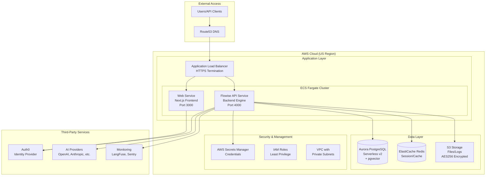

# TheAnswer.AI Technical Architecture for Security Review

## Executive Summary

TheAnswer.AI is an enterprise AI agent platform deployed on AWS infrastructure using containerized microservices. The solution provides secure, scalable AI capabilities through a multi-layered architecture with comprehensive monitoring and change tracking.

## 1. Deployment Architecture

### AWS Infrastructure Overview



### Deployment Method

-   **Platform**: AWS ECS Fargate (Serverless Containers)
-   **Orchestration**: AWS Copilot CLI
-   **Environments**: Staging and Production (isolated)

## 2. System Components & Interactions

### Core Services

| Component        | Purpose                           | Technology           | Interactions               |
| ---------------- | --------------------------------- | -------------------- | -------------------------- |
| **Web Frontend** | User interface                    | Next.js on Node.js   | → Auth0, → API Service     |
| **API Backend**  | Business logic & AI orchestration | Express.js/Flowise   | → Database, → AI Providers |
| **PostgreSQL**   | Primary data store                | Aurora Serverless v2 | ← API Service              |
| **Redis Cache**  | Session & rate limiting           | ElastiCache          | ← Both Services            |
| **S3 Storage**   | File & log storage                | AWS S3               | ← API Service              |

### Security Components

| Component           | Purpose                        | Implementation     |
| ------------------- | ------------------------------ | ------------------ |
| **Auth0**           | Authentication & authorization | JWT tokens (RS256) |
| **AWS IAM**         | Service permissions            | Role-based access  |
| **Secrets Manager** | Credential storage             | Encrypted secrets  |
| **VPC**             | Network isolation              | Private subnets    |

## 3. Data Flow Paths

### User Request Flow

```
1. User → HTTPS → Load Balancer
2. Load Balancer → Web Service (if UI request)
3. Web Service → Auth0 (authentication check)
4. Web Service → API Service (data request)
5. API Service → Database/Cache (data retrieval)
6. API Service → AI Provider (if AI processing needed)
7. Response flows back through the same path
```

### Data Storage Flow

```
- User Data → Encrypted → PostgreSQL
- Session Data → Redis Cache (TTL-based)
- File Uploads → S3 (AES256 encrypted)
- Credentials → AWS Secrets Manager
- Logs → CloudWatch & S3
```

## 4. Third-Party Dependencies

### Critical Dependencies

| Service              | Purpose             | Data Shared                | Security Measures                 |
| -------------------- | ------------------- | -------------------------- | --------------------------------- |
| **Auth0**            | Identity management | User profiles, auth tokens | Encrypted transit, JWT signing    |
| **OpenAI/Anthropic** | AI processing       | Prompts and responses      | API key authentication, TLS       |
| **AWS Services**     | Infrastructure      | All application data       | IAM roles, encryption at rest     |
| **LangFuse**         | AI monitoring       | Model interactions         | Separate API keys, data isolation |
| **Sentry**           | Error tracking      | Application errors         | Filtered sensitive data           |

### Integration Points

-   All external APIs use TLS encryption
-   API keys stored in AWS Secrets Manager
-   Rate limiting on all external calls
-   Timeout controls for resilience

## 5. Change Tracking & Monitoring

### Infrastructure Changes

-   **Git Version Control**: All infrastructure as code
-   **AWS CloudTrail**: Audit logs for all AWS API calls
-   **Copilot Deployments**: Tracked via Git commits
-   **Automated Rollback**: Blue-green deployments

### Application Monitoring

| System                 | Purpose                    | Coverage                     |
| ---------------------- | -------------------------- | ---------------------------- |
| **CloudWatch**         | Infrastructure metrics     | CPU, memory, network         |
| **Application Logs**   | Debugging & audit          | All API calls logged         |
| **LangFuse**           | AI usage tracking          | Token usage, quality metrics |
| **Prometheus Metrics** | Custom application metrics | Business KPIs                |
| **Sentry**             | Error tracking             | Frontend errors              |

### Security Monitoring

-   **Failed authentication attempts** tracked
-   **Rate limit violations** logged
-   **Unusual API patterns** flagged
-   **Resource access** audited via CloudTrail

### Change Management Process

1. All changes go through Git pull requests
2. Automated testing in staging environment
3. Manual approval required for production
4. Deployment history maintained in Git
5. Rollback capability within minutes

## 6. Security Controls Summary

### Data Protection

-   **Encryption at Rest**: S3 (AES256), RDS (AWS managed)
-   **Encryption in Transit**: TLS 1.2+ everywhere
-   **Secrets Management**: AWS Secrets Manager
-   **Access Control**: JWT tokens + API keys

### Network Security

-   **Private Subnets**: Database and cache isolated
-   **Security Groups**: Least privilege firewall rules
-   **Load Balancer**: HTTPS termination
-   **DDoS Protection**: AWS Shield Standard

### Compliance Features

-   **Audit Logging**: Complete API audit trail
-   **Data Isolation**: Multi-tenant separation
-   **GDPR Support**: Data export/deletion capabilities
-   **SOC2 Alignment**: Security controls in place

## Contact for Security Questions

For detailed security discussions or additional documentation:

-   Security Team: security@theanswer.ai
-   Architecture Team: architecture@theanswer.ai

---

_This document provides a high-level overview for security review purposes. Detailed implementation specifics are available upon request under NDA._
