# Flowise Agent Governance — Design Document

> HLD · LLD · Flowcharts (Mermaid)

---

## Table of Contents

1. [High-Level Design (HLD)](#1-high-level-design)
2. [Low-Level Design (LLD)](#2-low-level-design)
3. [Flowcharts](#3-flowcharts)
    - 3.1 System Context
    - 3.2 Happy-path (allow)
    - 3.3 Hard-deny path
    - 3.4 Escalation / HITL pause
    - 3.5 HITL resume — proceed (approve as-is / redirect)
    - 3.6 HITL resume — reject
    - 3.7 Policy evaluation internals
    - 3.8 Audit lifecycle (sequence)
4. [Appendix: Rule Evaluation Examples](#4-appendix-rule-evaluation-examples)

---

## 1. High-Level Design

### 1.1 Purpose

The governance layer sits **between the LLM's tool-call decision and actual tool execution**. It enforces a declarative JSON policy file at runtime, produces a tamper-evident append-only audit log, and surfaces Human-in-the-Loop (HITL) checkpoints to the chat UI via SSE events — all without modifying the underlying tools or the LLM.

### 1.2 System Context Diagram

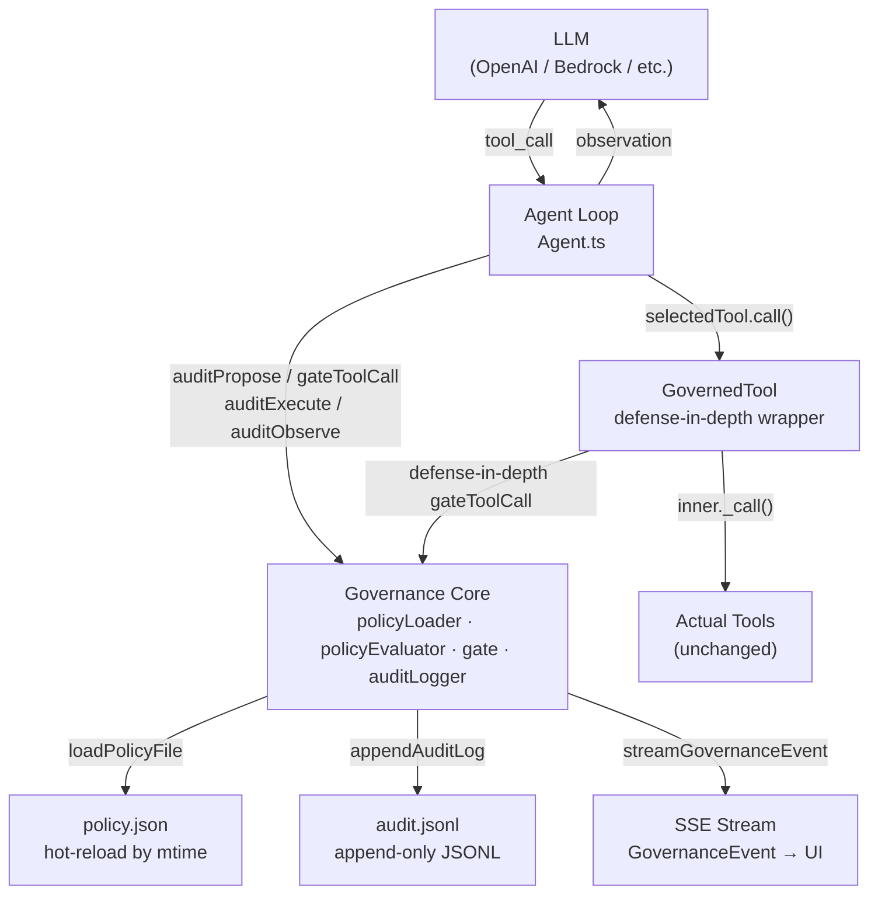

### 1.3 Key Design Principles

| Principle                | How it is achieved                                                                                      |
| ------------------------ | ------------------------------------------------------------------------------------------------------- |
| **Non-invasive**         | Tools are wrapped via `GovernedTool`; LLM and tool implementations are unchanged                        |
| **Declarative policy**   | JSON rules file; no code changes needed to add/change rules                                             |
| **Hot-reload**           | `policyLoader` caches by `mtime`; policy changes take effect on the next tool call                      |
| **First-match wins**     | Rules evaluated in file order; specific rules go before wildcards                                       |
| **Defense-in-depth**     | `GovernedTool._call()` re-checks policy even if the agent loop is bypassed                              |
| **Tamper-evident audit** | Append-only JSONL; every step (propose → policy_decision → hitl → execute → observe) is a separate line |
| **UI-first HITL**        | `GovernanceEvent` objects streamed via SSE so the chat UI renders approval widgets natively             |

### 1.4 Three Governance Outcomes

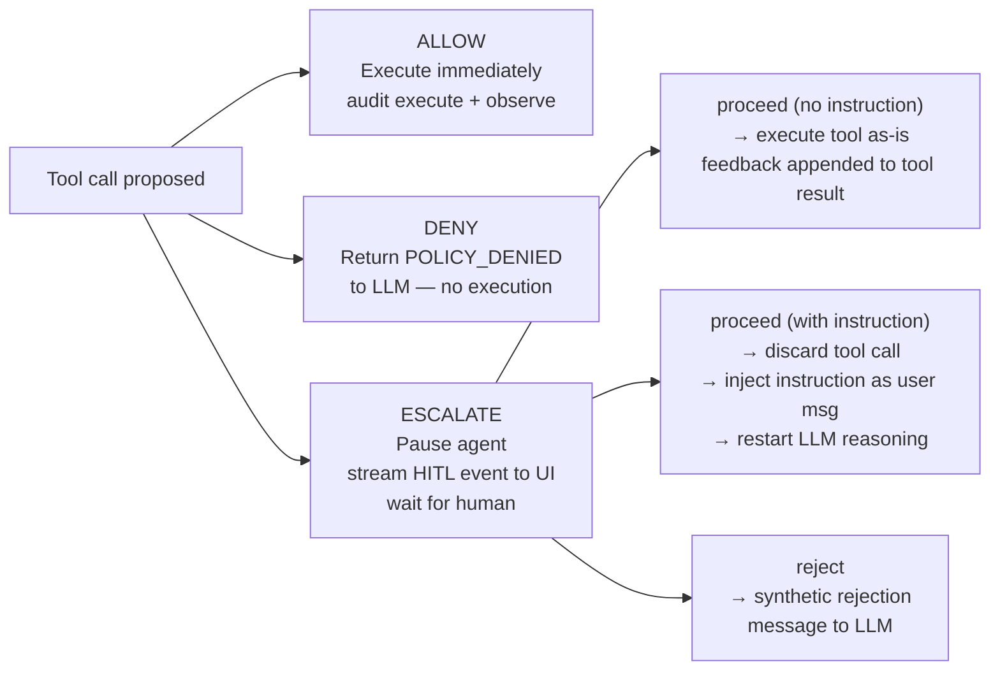

### 1.5 Module Responsibilities

| Module               | Responsibility                                                                                      |
| -------------------- | --------------------------------------------------------------------------------------------------- |
| `types.ts`           | Shared TypeScript interfaces: `PolicyRule`, `PolicyDecision`, `AuditEntry`, `GovernanceEvent`, etc. |
| `policyLoader.ts`    | Reads and hot-reloads the JSON policy file; validates schema                                        |
| `policyEvaluator.ts` | Pure function: evaluates rules against `(toolName, args, context)` → `PolicyDecision`               |
| `gate.ts`            | Orchestrates a single gate check; writes audit entries; builds SSE events                           |
| `auditLogger.ts`     | Appends a timestamped JSONL line to the audit file                                                  |
| `governedTool.ts`    | Wraps a `Tool` with a defense-in-depth gate check on every `.call()`                                |
| `Agent.ts`           | Wires governance into the ReAct loop; owns the HITL pause/resume lifecycle                          |

---

## 2. Low-Level Design

### 2.1 Data Structures

#### PolicyRule

```typescript
interface PolicyRule {
    id: string // unique rule identifier
    effect: 'allow' | 'deny' | 'escalate'
    match: { tool: string } // exact | prefix wildcard ("write_*") | "*"
    when?: PolicyCondition[] // ALL must match (AND)
    anyOf?: PolicyCondition[] // AT LEAST ONE must match (OR)
    message?: string
}

interface PolicyCondition {
    path: string // dot-path into { args, context }  e.g. "args.to", "context.environment"
    op: 'eq' | 'neq' | 'gt' | 'gte' | 'lt' | 'lte' | 'contains' | 'not-contains' | 'starts-with' | 'regex'
    value: unknown
}
```

#### PolicyDecision (output of evaluator)

```typescript
interface PolicyDecision {
    effect: 'allow' | 'deny' | 'escalate'
    ruleId: string // "default-allow" if no rule matched
    message: string
}
```

#### AuditEntry (one JSONL line)

```typescript
interface AuditEntry {
    ts: string // ISO-8601 timestamp
    traceId?: string // correlates all steps of one tool invocation
    step: AuditStep // see lifecycle below
    tool?: string
    args?: Record<string, unknown>
    ruleId?: string
    effect?: PolicyEffect
    message?: string
    humanDecision?: 'proceed' | 'reject'
    feedback?: string // reviewer instruction (redirect path) or free-text note
    observation?: string // truncated to 500 chars
    sessionId?: string
    chatId?: string
    nodeId?: string
    input?: string // session_start only
    output?: string // session_end only
    toolCallCount?: number // session_end only
}
```

#### GovernanceEvent (SSE payload to UI)

```typescript
interface GovernanceEvent {
    traceId: string
    step: AuditStep
    tool?: string
    args?: Record<string, unknown>
    effect?: PolicyEffect
    ruleId?: string
    message?: string
    humanDecision?: string
    feedback?: string
    ts: string
}
```

#### IHumanInput (HITL resume payload from UI)

```typescript
interface IHumanInput {
    type: 'proceed' | 'reject'
    startNodeId: string
    feedback?: string
    /**
     * Plain-text reviewer instruction (optional).
     * - Empty / absent → approve as-is: tool executes with original args.
     *   Feedback (if any) is appended to the tool result so the LLM sees it.
     * - Non-empty → redirect: pending tool call is discarded, instruction is
     *   injected as a new user message, and the LLM is re-invoked from scratch.
     */
    modifiedArgs?: string
}
```

### 2.2 Audit Step Lifecycle

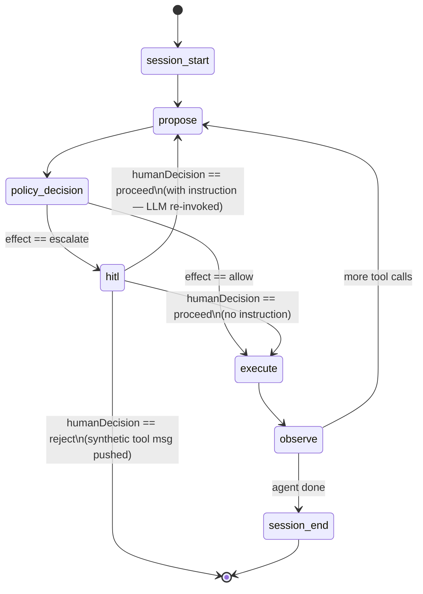

### 2.3 Component Interaction (Class Diagram)

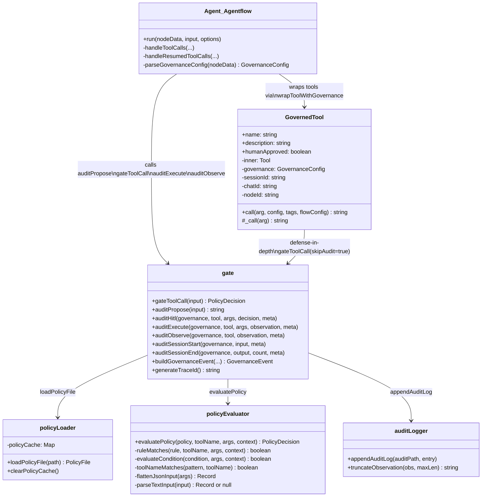

### 2.4 Policy Evaluation Algorithm

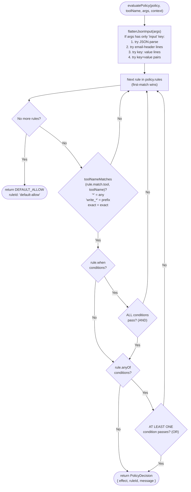

### 2.5 GovernedTool Defense-in-Depth

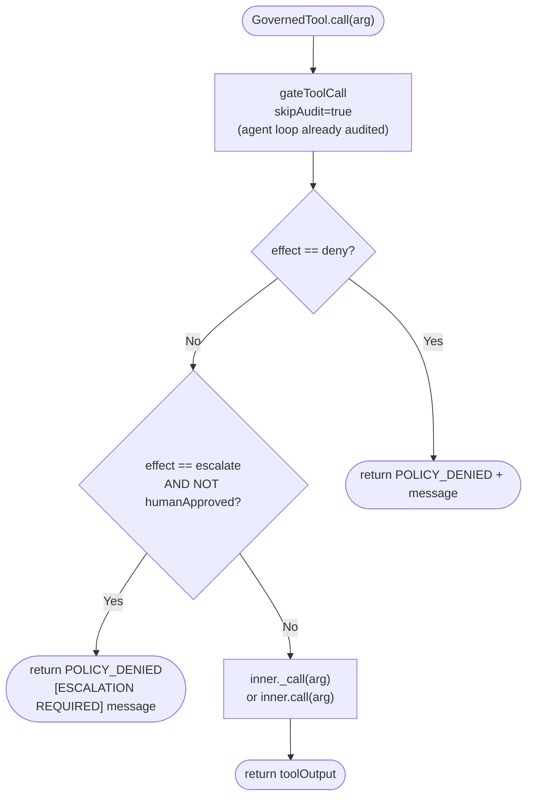

### 2.6 Configuration (per Agent node)

| Input field              | Type                  | Description                                                                                                                                                                                 |
| ------------------------ | --------------------- | ------------------------------------------------------------------------------------------------------------------------------------------------------------------------------------------- |
| `agentEnableGovernance`  | boolean               | Master switch. If true, both path fields below must be set or governance is disabled with a warning.                                                                                        |
| `agentPolicyFilePath`    | string                | Absolute path to `agent-policies.json`. Required when governance is enabled.                                                                                                                |
| `agentAuditLogPath`      | string                | Absolute path to `audit.jsonl`. Required when governance is enabled.                                                                                                                        |
| `agentGovernanceContext` | JSON string or object | Runtime context injected into every policy evaluation e.g. `{"environment":"production"}`. Accepts a raw JSON string or a pre-resolved object (e.g. from a `{{ $flow.state.* }}` variable). |

> **Validation**: `parseGovernanceConfig` returns `undefined` (governance disabled) if either path is missing or blank, logging a `[Governance]` warning. This prevents a crash from `loadPolicyFile(undefined)` at runtime.

---

## 3. Flowcharts

### 3.1 System Context (C4-style)

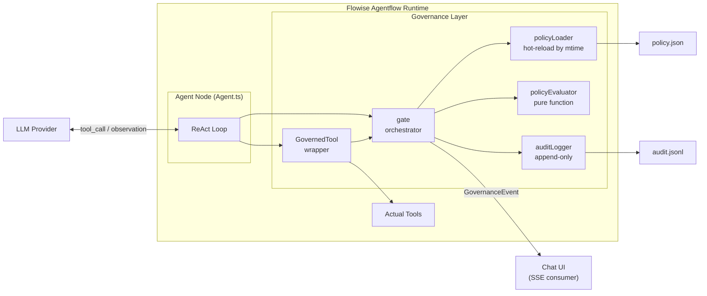

---

### 3.2 Happy-Path (ALLOW)

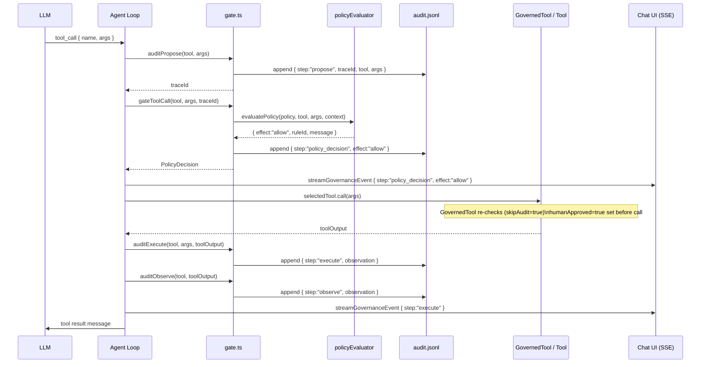

---

### 3.3 Hard-Deny Path

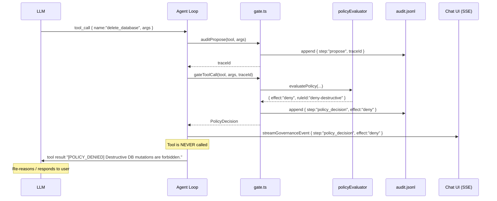

---

### 3.4 Escalation — HITL Pause

````mermaid
sequenceDiagram
    participant LLM
    participant AgentLoop as Agent Loop
    participant Gate as gate.ts
    participant PolicyEval as policyEvaluator
    participant AuditLog as audit.jsonl
    participant UI as Chat UI (SSE)
    participant Human

    LLM->>AgentLoop: tool_call { name:"send_email", args }
    AgentLoop->>Gate: auditPropose(tool, args)
    Gate->>AuditLog: append { step:"propose", traceId }
    Gate-->>AgentLoop: traceId

    AgentLoop->>Gate: gateToolCall(tool, args, traceId)
    Gate->>PolicyEval: evaluatePolicy(...)
    PolicyEval-->>Gate: { effect:"escalate", ruleId:"escalate-external-email" }
    Gate->>AuditLog: append { step:"policy_decision", effect:"escalate" }
    Gate-->>AgentLoop: PolicyDecision

    AgentLoop->>UI: streamGovernanceEvent { step:"policy_decision", effect:"escalate" }

    Note over AgentLoop: Append escalation block to LLM response content:\n"**Policy escalation** (rule: escalate-external-email): ...\nAttempting to use tool: ```json ... ```"

    AgentLoop->>UI: streamGovernanceEvent { step:"hitl" }
    Note over UI: Renders approval widget with tool args

    AgentLoop-->>AgentLoop: return { isWaitingForHumanInput:true, pendingToolCalls }
    Note over AgentLoop: Checkpoint saved (full message history)

    UI->>Human: Show approval widget
    Note over Human: Reviews tool name, args, policy message
````

---

### 3.5 HITL Resume — Proceed

The proceed path has two branches depending on whether the reviewer typed an instruction.

#### 3.5a Proceed — Approve as-is (no instruction)

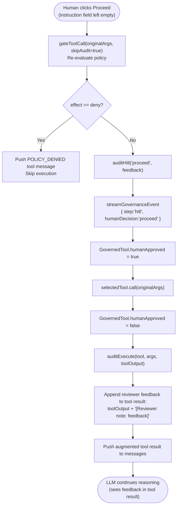

#### 3.5b Proceed — Redirect (instruction provided)

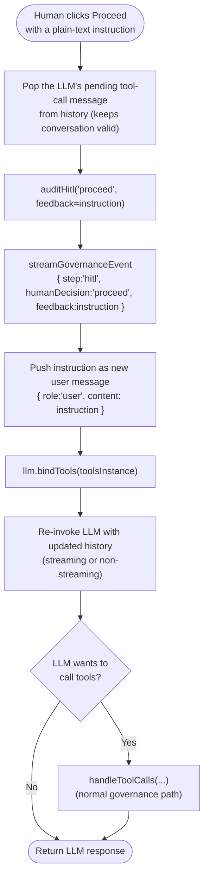

---

### 3.6 HITL Resume — Reject

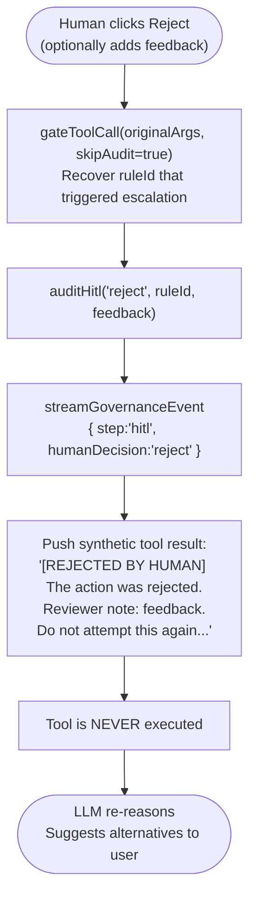

---

### 3.7 Policy Evaluation Internals

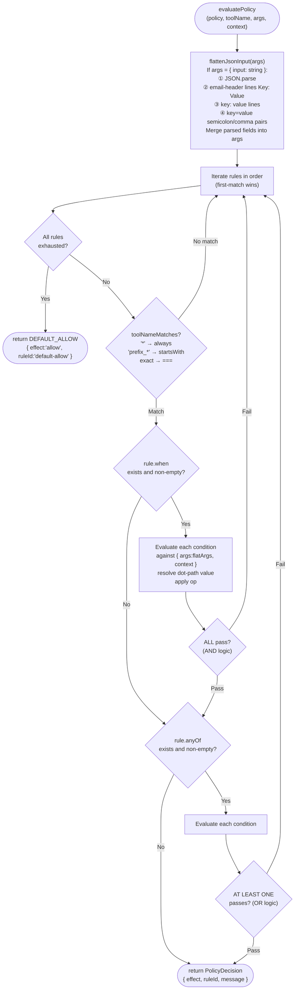

---

### 3.8 Audit Lifecycle (Full Session Sequence)

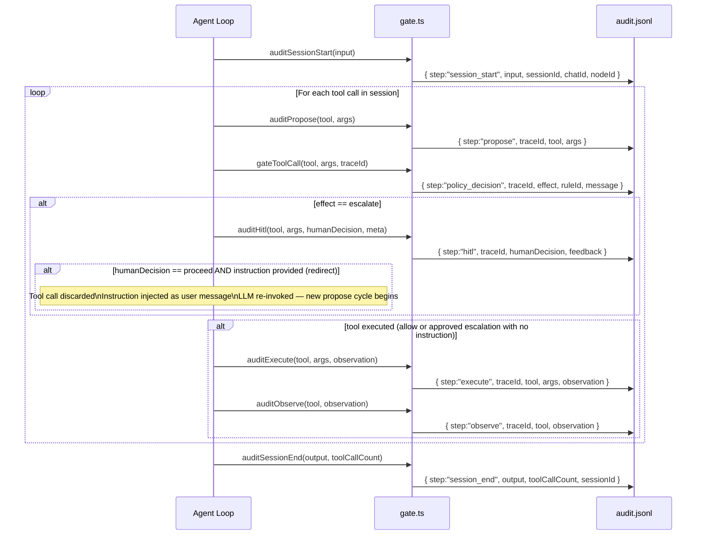

---

## 4. Appendix: Rule Evaluation Examples

### Example 1 — Internal email → ALLOW

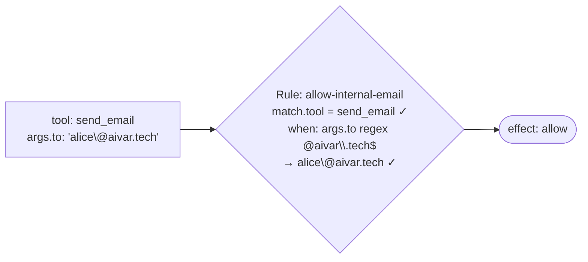

### Example 2 — External email → ESCALATE

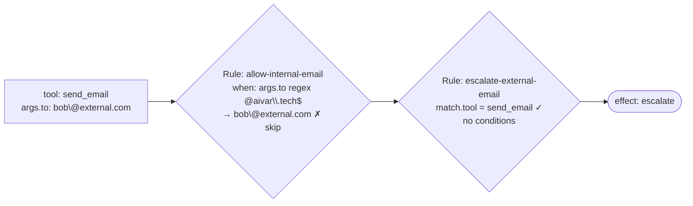

### Example 3 — Destructive tool → DENY

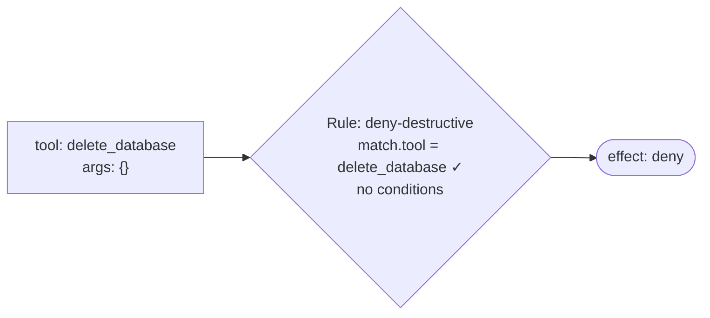

### Example 4 — Production wildcard → ESCALATE

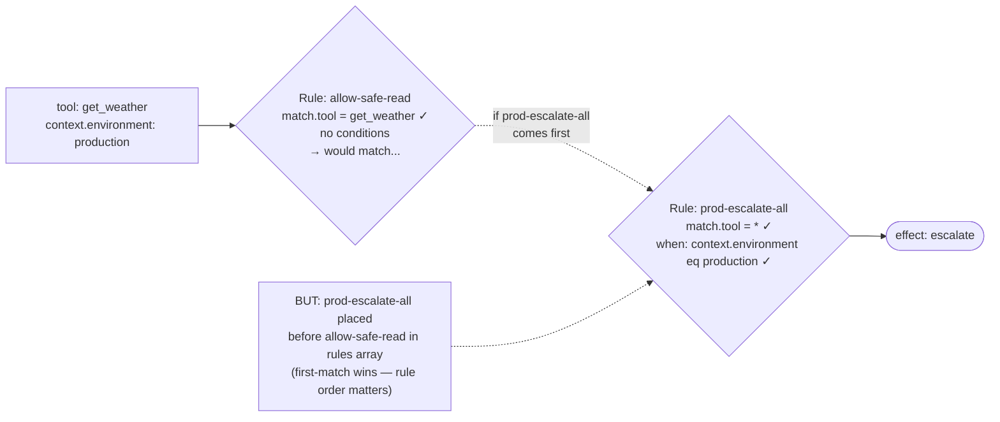

### Example 5 — Wildcard write tool → ESCALATE

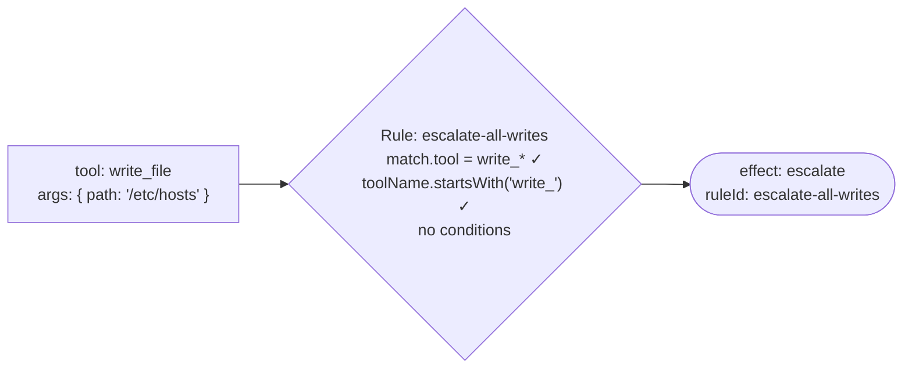

### Example 6 — No matching rule → DEFAULT ALLOW

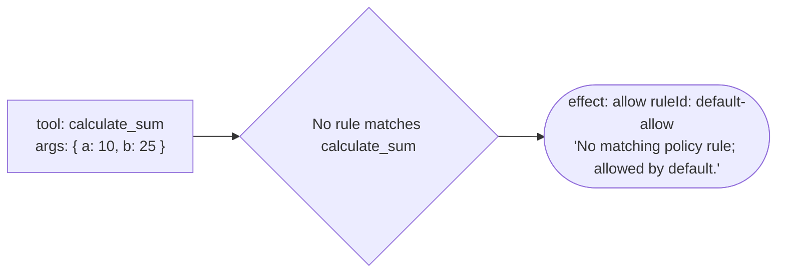
