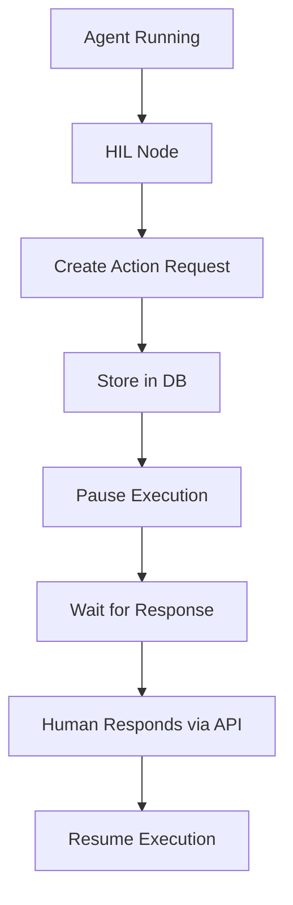

# Human-in-the-Loop (HIL) Node for Flowise

## Overview
The Human-in-the-Loop (HIL) node enables asynchronous human interaction within Flowise agent flows. It allows agents to pause execution, request human input, and resume once input is received.

## Features
- Asynchronous human interaction
- Multiple interaction types (approval, feedback, input, review)
- API-first design for external system integration
- Seamless integration with existing Flowise checkpoint system
- State preservation during interrupts

## Architecture

### Components
1. HIL Node
   - Sequential agent node type
   - Handles flow interruption
   - Manages state preservation
   - Processes human responses

2. Action Requests
   - Database entity for tracking interactions
   - Stores context and metadata
   - Manages request lifecycle
   - Handles response processing

3. API Layer
   ```typescript
   // Create Action Request
   POST /api/v1/hil/actions
   {
       flowId: string
       sessionId: string
       nodeId: string
       type: string
       context: {
           question: string
           options?: any[]
           metadata: any
       }
   }

   // Submit Response
   POST /api/v1/hil/actions/:actionId/respond
   {
       response: {
           value: any
           metadata?: any
       }
   }
   ```

4. State Management
   ```typescript
   interface IHILState extends ISeqAgentsState {
       pendingActionId?: string
       actionContext?: ICommonObject
   }
   ```

### Flow Pattern


## Integration

### Node Integration
```typescript
class HumanInTheLoop_SeqAgents implements INode {
    async init(nodeData: INodeData, input: string, options: ICommonObject) {
        // Node initialization
        // State management
        // Action request creation
        // Flow control
    }
}
```

### API Integration
External systems can interact with HIL nodes through RESTful APIs:

1. Action Management
   - Create actions
   - List pending actions
   - Submit responses
   - Cancel/reject actions

2. Flow Control
   - Check flow status
   - Resume flow execution
   - Batch operations

3. Webhooks
   - Real-time notifications
   - Status updates
   - Error handling

## Usage

### 1. Basic Approval Flow
```typescript
// Configure HIL Node
{
    type: 'approval',
    question: "Should I proceed with deleting records?",
    options: ['approve', 'reject']
}
```

### 2. Complex Feedback
```typescript
// Configure HIL Node
{
    type: 'feedback',
    question: "Review this generated content",
    options: {
        type: 'form',
        fields: [
            {label: 'Quality', type: 'rating', scale: 1-5},
            {label: 'Comments', type: 'textarea'}
        ]
    }
}
```

### 3. Data Input
```typescript
// Configure HIL Node
{
    type: 'input',
    question: "What's the correct customer ID?",
    validation: {
        type: 'number',
        required: true
    }
}
```

## Security
- API Authentication
- Rate Limiting
- Request Validation
- Timeout Handling

## Best Practices
1. Action Design
   - Clear, specific questions
   - Appropriate timeout values
   - Validation rules
   - Error handling

2. State Management
   - Minimal state preservation
   - Clear cleanup
   - Timeout handling

3. API Integration
   - Proper error handling
   - Retry mechanisms
   - Webhook reliability
   - Response validation

## API Reference
See [API Documentation](./api-endpoints.md) for detailed endpoint specifications.

## Database Schema
See [Database Schema](./database-schema.md) for entity relationships and migrations.

## Integration Guide
See [Integration Guide](./integration.md) for detailed implementation examples.
