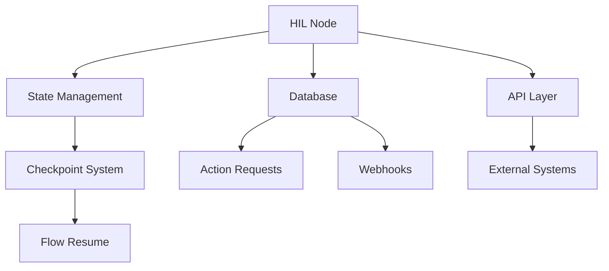
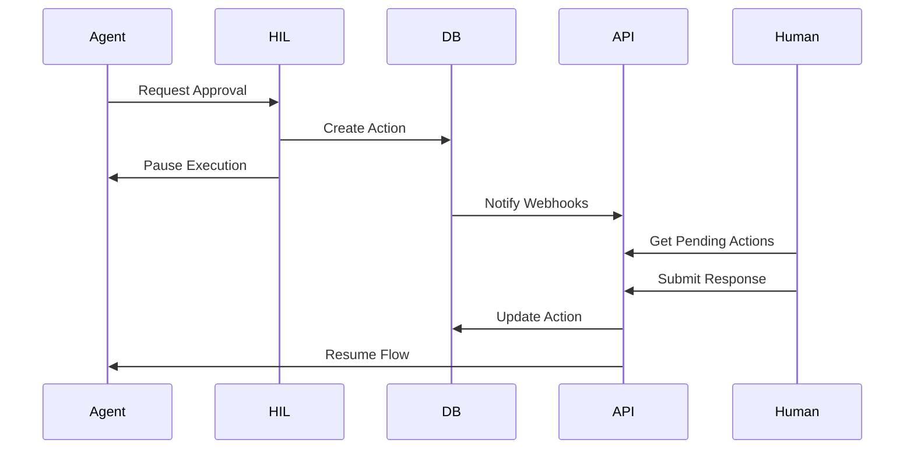
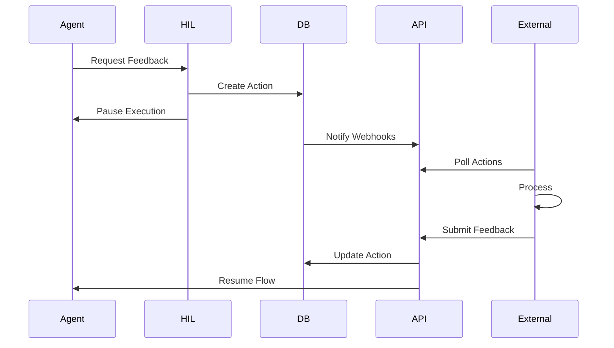

# Integration Guide

## Overview

This guide demonstrates how the Human-in-the-Loop (HIL) components integrate with Flowise's existing architecture and with external systems.

## Component Integration



## Integration Points

### 1. Node with Sequential Agents

```typescript
// Integration with existing sequential agent system
class HumanInTheLoop_SeqAgents implements INode {
    async init(nodeData: INodeData, input: string, options: ICommonObject) {
        const workerNode = async (state: ISeqAgentsState, config: RunnableConfig) => {
            // 1. Create action request with channel
            const actionRequest = await createActionRequest({
                flowId: options.chatflowid,
                sessionId: options.sessionId,
                nodeId: nodeData.id,
                type: nodeData.inputs?.actionType,
                channel: nodeData.inputs?.channel || 'ui',
                channelConfig: nodeData.inputs?.channelConfig || {},
                context: {
                    question: input,
                    options: nodeData.inputs?.options
                }
            })

            // 2. Notify channel handlers
            await this.notifyChannels(actionRequest)

            // 3. Return interrupt state
            return {
                messages: [
                    new AIMessage({
                        content: '',
                        additional_kwargs: {
                            nodeId: nodeData.id,
                            actionId: actionRequest.id,
                            interrupt: true,
                            channel: actionRequest.channel
                        }
                    })
                ]
            }
        }

        return {
            id: nodeData.id,
            node: workerNode,
            name: 'humanInTheLoop',
            type: 'hil'
        }
    }

    private async notifyChannels(actionRequest: ActionRequest) {
        const channelHandlers = {
            ui: async () => {
                // Handle UI notification (default behavior)
            },
            email: async () => {
                const { to, cc, subject, template } = actionRequest.channelConfig.email
                await emailService.send({
                    to,
                    cc,
                    subject,
                    template,
                    context: {
                        actionId: actionRequest.id,
                        question: actionRequest.context.question,
                        responseUrl: `${baseUrl}/actions/${actionRequest.id}/respond`
                    }
                })
            },
            slack: async () => {
                const { channels, blocks } = actionRequest.channelConfig.slack
                await slackService.postMessage({
                    channels,
                    blocks: blocks || this.generateDefaultSlackBlocks(actionRequest)
                })
            },
            teams: async () => {
                const { channels, template } = actionRequest.channelConfig.teams
                await teamsService.notify({
                    channels,
                    template,
                    actionRequest
                })
            },
            webhook: async () => {
                const { url, method, headers } = actionRequest.channelConfig.webhook
                await axios({
                    method: method || 'POST',
                    url,
                    headers,
                    data: {
                        action: actionRequest,
                        responseEndpoint: `/api/v1/hil/actions/${actionRequest.id}/respond`
                    }
                })
            }
        }

        const handler = channelHandlers[actionRequest.channel]
        if (handler) {
            await handler()
        }
    }
}
```

### 2. State Management Integration

```typescript
// In buildAgentGraph.ts
const graph = seqGraph.compile({
    checkpointer: memory,
    interruptBefore: [...interruptToolNodeNames, 'hil']
})

// Handle HIL interrupts
if (lastMessageRaw.additional_kwargs?.actionId) {
    const actionId = lastMessageRaw.additional_kwargs.actionId
    
    finalAction = {
        id: actionId,
        type: 'hil_action',
        mapping: {
            actionId,
            type: nodeData.inputs?.actionType
        }
    }

    if (shouldStreamResponse && sseStreamer) {
        sseStreamer.streamActionEvent(chatId, finalAction)
    }
}
```

### 3. Database Integration

```typescript
// Service layer for database operations
export class ActionRequestService {
    constructor(
        @InjectRepository(ActionRequest)
        private actionRequestRepo: Repository<ActionRequest>,
        @InjectRepository(ActionAudit)
        private actionAuditRepo: Repository<ActionAudit>
    ) {}

    async createActionRequest(data: Partial<ActionRequest>): Promise<ActionRequest> {
        const request = this.actionRequestRepo.create(data)
        await this.actionRequestRepo.save(request)
        
        // Create audit entry
        await this.actionAuditRepo.save({
            actionId: request.id,
            event: 'created',
            data: request
        })

        return request
    }

    // ... other methods
}
```

### 4. API Integration

```typescript
// Controller for API endpoints
@Controller('api/v1/hil')
export class HILController {
    constructor(
        private actionService: ActionRequestService,
        private flowService: FlowService
    ) {}

    @Post('actions/:actionId/respond')
    async respondToAction(
        @Param('actionId') actionId: string,
        @Body() response: any,
        @Headers('x-response-channel') responseChannel: string
    ) {
        // 1. Update action with channel info
        const action = await this.actionService.updateActionRequest(actionId, {
            status: 'completed',
            response: {
                ...response,
                respondedVia: responseChannel
            }
        })

        // 2. Notify other channels of completion
        await this.notifyChannelsOfCompletion(action)

        // 3. Resume flow
        await this.flowService.resumeFlow({
            flowId: action.flowId,
            sessionId: action.sessionId,
            actionId: action.id,
            response: response
        })

        return { success: true }
    }

    private async notifyChannelsOfCompletion(action: ActionRequest) {
        // Notify all relevant channels that the action is complete
        if (action.channel !== 'ui') {
            // Update UI if it wasn't the response channel
            await this.uiService.updateActionStatus(action)
        }

        if (action.channelConfig.email && action.channel !== 'email') {
            // Send email notification of completion
            await this.emailService.sendCompletionNotification(action)
        }

        // ... handle other channels
    }
}
```

### 5. External System Integration

```typescript
// Example: External system integration
class ExternalSystemIntegration {
    constructor(private apiClient: APIClient) {}

    async pollAndProcessActions() {
        // 1. Get pending actions
        const actions = await this.apiClient.get('/api/v1/hil/actions', {
            params: { status: 'pending' }
        })

        // 2. Process each action
        for (const action of actions.data) {
            try {
                // 3. Process in external system
                const response = await this.processAction(action)

                // 4. Send response back
                await this.apiClient.post(
                    `/api/v1/hil/actions/${action.id}/respond`,
                    { response }
                )
            } catch (error) {
                // Handle errors
            }
        }
    }
}
```

## Flow Examples

### 1. Basic Approval Flow



### 2. Complex Feedback Flow



## Best Practices

### 1. Error Handling
```typescript
try {
    const action = await actionService.createActionRequest(data)
    // ... process action
} catch (error) {
    if (error instanceof ActionValidationError) {
        // Handle validation errors
    } else if (error instanceof DatabaseError) {
        // Handle database errors
    } else {
        // Handle unexpected errors
    }
}
```

### 2. State Management
```typescript
// Keep state minimal
const hilState = {
    pendingActionId: actionId,
    actionContext: {
        type: actionType,
        timestamp: new Date()
    }
}

// Clean up after completion
const cleanupState = (state) => {
    delete state.pendingActionId
    delete state.actionContext
}
```

### 3. Timeout Handling
```typescript
// Set timeout on action creation
const action = await actionService.createActionRequest({
    ...data,
    timeout: 30 * 60 * 1000 // 30 minutes
})

// Handle timeouts
const handleTimeout = async (actionId) => {
    await actionService.updateActionRequest(actionId, {
        status: 'expired'
    })
    // Notify relevant systems
}
```

## Security Considerations

1. API Authentication
```typescript
@UseGuards(AuthGuard)
export class HILController {
    // ... controller methods
}
```

2. Data Validation
```typescript
class ActionRequestDTO {
    @IsUUID()
    flowId: string

    @IsString()
    type: string

    @ValidateNested()
    context: ActionContextDTO
}
```

3. Rate Limiting
```typescript
@UseGuards(RateLimitGuard)
@Throttle(100, 900) // 100 requests per 15 minutes
export class HILController {
    // ... controller methods
}
```

### Channel Configuration Examples

```typescript
// 1. Email Channel
const emailConfig = {
    channel: 'email',
    channelConfig: {
        email: {
            to: ['approver@company.com'],
            cc: ['manager@company.com'],
            subject: 'Action Required: Review Generated Content',
            template: 'approval-request'
        }
    }
}

// 2. Slack Channel
const slackConfig = {
    channel: 'slack',
    channelConfig: {
        slack: {
            channels: ['#approvals'],
            users: ['U123456'],
            blocks: [
                {
                    type: 'section',
                    text: {
                        type: 'mrkdwn',
                        text: 'New approval request'
                    }
                },
                {
                    type: 'actions',
                    elements: [
                        {
                            type: 'button',
                            text: {
                                type: 'plain_text',
                                text: 'Approve'
                            },
                            value: 'approve'
                        }
                    ]
                }
            ]
        }
    }
}

// 3. Teams Channel
const teamsConfig = {
    channel: 'teams',
    channelConfig: {
        teams: {
            channels: ['General'],
            template: 'adaptive-card-approval'
        }
    }
}

// 4. Webhook Channel
const webhookConfig = {
    channel: 'webhook',
    channelConfig: {
        webhook: {
            url: 'https://external-system.com/handle-action',
            headers: {
                'Authorization': 'Bearer token'
            }
        }
    }
}
``` 